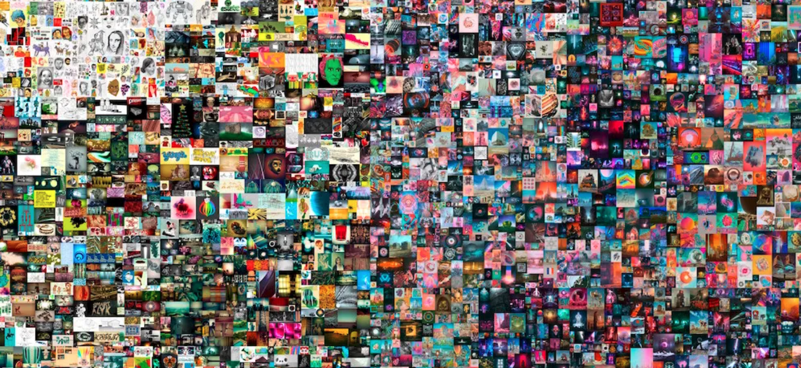
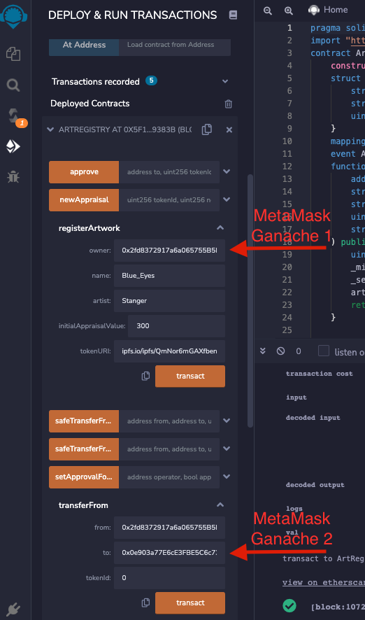

# Digital_Art_NFT
Create a digital art NFT, register art to unique ID, pin to Pinata/IPFS, sell art on Streamlit front-end

## Background

My client, a prominate Tatoo Artist named Stang in Southwest Florida, would like to have an NFT created and each token associated with individual tatoo artwork that she has created. She would like to be able to transfer her NFT tokens to other wallets, a video game designer for example, for use in the game as an items of purchase for the game players.

The objective of this Smart Contract NFT project is to create an NFT token for digital Tatoo Art. Once the NFT token is created, I will develop, compile, and deploy a Smart Contract using Solidity and the ERC721 standard. The contract will have two primary functions, an art token creation and registration and secondly a token transfer function. I will then create two .py files, the first containing functions to create a json out of the data and pin to an ipfs file for distribution onto the Pinata gateway and stored on the InterPlanetary Filing System (IPFS). The second .py file will load in the deployed contract, pull in and use a Ganache blockchain, and create a UI utilizing Streamlit.

---

## Solidity (.sol), Python (.py), and JSON (.json) Files

The following files are associated with the Art NFT project:

[Solidity Smart Contract](./ArtRegistry/contracts/ArtRegistry.sol)

[JSON/IPFS Functions](./ArtRegistry/pinata.py)

[Streamlit Front-End](./ArtRegistry/app.py)

[Deployed Smart Contract ABI File](./ArtRegistry/contracts/compiled/artregistry_abi.json)

---

## Project Objectives

The following development was performed to complete the project:

1. Create an Non Fungible Token (NFT), using the ERC721 standard, called "Art Registry Token" and symbol of "ART". Map the tokens/art to a collection called "Art Collection".

2. Develop a function that registers each NFT token to a specific piece of digital art and tie it to a unique identifier.

3. Develop a function within the contract that will allow the owner of the NFT Token to transfer the ART Token to another wallet.

4. Deploy the Smart Contract on Remix within an Injected Web 3 environment connecting to a Meta Max digital wallet, using a Ganache blockchain to capture and memorialize the transactions. Use an ethereum test net Rinkerby to test the functionality.

5. Develop a set of functions, using Python, that will take the data of the digital image, turn it into a json string and "pin" it to the InterPlanatery Filing System (IPFS) utilizing call functions and capablities within Pinata.com.

6. Develop a front-end UI/UX using Streamlit to allow user ease in performing the functions of ART Registry, Display Art, and Transfer ART.
    a. Using Python, import functions to create JSON string to post to IPFS.
    b. Creat Streamlit front-end and launch.

7. Demonstrate Functionity using Streamlit User Interface.

## StreamLit User Interface - Functional Demonstration

* Compile the contracts by using Remix

* Successful Deploy of Smart Contract on Remix

* ART Registry Demonstration on Streamlit Front-End UI

* Successful pin of ART to Pinata Gateway and creation of JSON

* Successful Transfer of ART Token on Streamlit Front-End UI

* Review Meta Mask for successful transfer

* Review Transaction Logs on Etherscan

---
